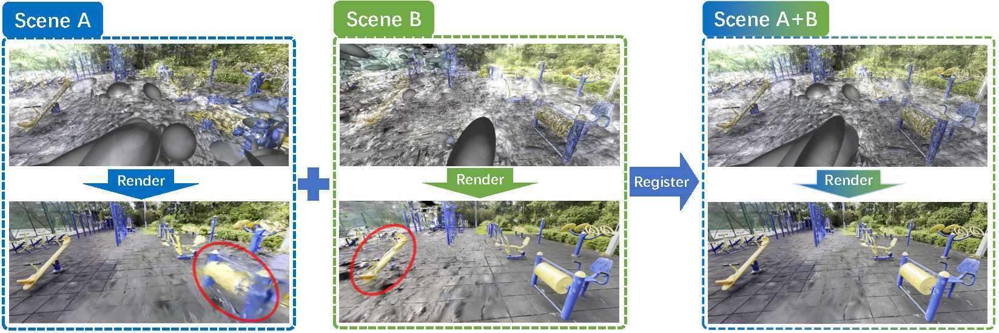

# GaussReg: Fast 3D Registration with Gaussian Splatting (ECCV2024)


## [Project Page](https://jiahao620.github.io/gaussreg/) | [Paper](https://arxiv.org/abs/2407.05254) 

---

## Install
This implementation uses Python 3.8.0, [torch1.7.1+cu110](http://pytorch.org/). We recommend to use [conda](https://docs.conda.io/en/latest/miniconda.html) to deploy the environment.

* Install with conda:
```
conda env create -f environment.yml
conda activate GaussReg
python setup.py build develop
```

---

## Demo

To test on your own data, please arange the data with the following structure:

```
- scene_name
    - A
        - output
            - point_cloud
                - iteration_30000
                    - point_cloud.ply
            - cameras.json    
            - cfg_args
            - input.ply
    - B
        - output
            - point_cloud
                - iteration_30000
                    - point_cloud.ply
            - cameras.json    
            - cfg_args
            - input.ply
```

### 1. Coarse Registration

The pretrained model of coarse registration can be download [here](https://1drv.ms/u/c/31078419ab45666e/ES42XZWK0PZMtty_7_kJ-GAByTEn_ArN8OI972UtD7PmYw?e=YUhFb3). Put the pretrained models under
```
weights/coarse_registration.pth.tar
```
To get the coarse registration between your scenes, please run the following command:
```
python experiments/geotransformer.gaussian_splatting.indoor/demo.py 
        --src_file scene_name/B/output/point_cloud/iteration_30000/point_cloud.ply
        --ref_file scene_name/A/output/point_cloud/iteration_30000/point_cloud.ply
        --weights weights/coarse_registration.pth.tar
```
The output visualization of gs point clouds and estimated_transform.npz will be saved under 'demo_outputs'. 

### 2. Fine Registration

TODO

### 3. Gaussian Splatting Fusion

To merge these two GS models (transform B into the coordinate system of A), please run the following command:

```
python gs_fusion.py --root_path scene_name --transform_path demo_outputs/estimated_transform.npz
```
The output file will be saved under 'scene_name/fuse'.

---
## Training and Test on the ScanNet-GSReg Dataset

### 0. Data Preparation
In our paper, we construct a dataset called ScanNet-GSReg, comprising 1379 scenes from the [ScanNet](https://github.com/ScanNet/ScanNet) dataset. And our GaussReg is trained on the ScanNetGSReg training set. The proposed ScanNet-GSReg dataset can be download [here](https://cuhko365.sharepoint.com/sites/ITSO_GAPLAB-GaussReg/Shared%20Documents/Forms/AllItems.aspx?id=%2Fsites%2FITSO%5FGAPLAB%2DGaussReg%2FShared%20Documents%2FScanNet%5FGSReg&p=true&ga=1). The dataset is organized as follows:

```
- ScanNet-GSReg
    - train
        - scene0000_00
            - A
                - output
                    - point_cloud
                        - iteration_10000
                            - point_cloud.ply
                    - cameras.json    
                    - cfg_args
                    - input.ply
                - images
                - sparse
                - features.h5
                - global-feats-netvlad.h5
                - matches.h5
                - pairs-netvlad.txt
            - B   
            - log.txt
        - scene0000_01
        ...
    - test
        - scene0707_00
        - scene0708_00
        ...
    - train.pkl 
    - test.pkl 
    - test_transformations.npz

```

### 1. Coarse Registration
The code for Coarse Registration is in 'experiments/geotransformer.gaussian_splatting.indoor'.
First, you should set "_C.data.dataset_root" as the dataset root path in config.py. Run the following code to train the Coarse Registration network:
```
python experiments/geotransformer.gaussian_splatting.indoor/trainval.py
```
Run the following code to test the Coarse Registration network on the ScanNet-GSReg dataset:

```
python experiments/geotransformer.gaussian_splatting.indoor/test.py
```

### 2. Fine Registration
TODO

---

## Citation
If you find our work is helpful, please cite
```
@article{chang2024gaussreg,
  title={Gaussreg: Fast 3d registration with gaussian splatting},
  author={Chang, Jiahao and Xu, Yinglin and Li, Yihao and Chen, Yuantao and Han, Xiaoguang},
  journal={arXiv preprint arXiv:2407.05254},
  year={2024}
}
```
## Acknowledgements
This repository is based on some excellent works, such as [geotransformer](https://github.com/qinzheng93/GeoTransformer) and [Gaussian Splatting](https://github.com/graphdeco-inria/gaussian-splatting). Many thanks.
